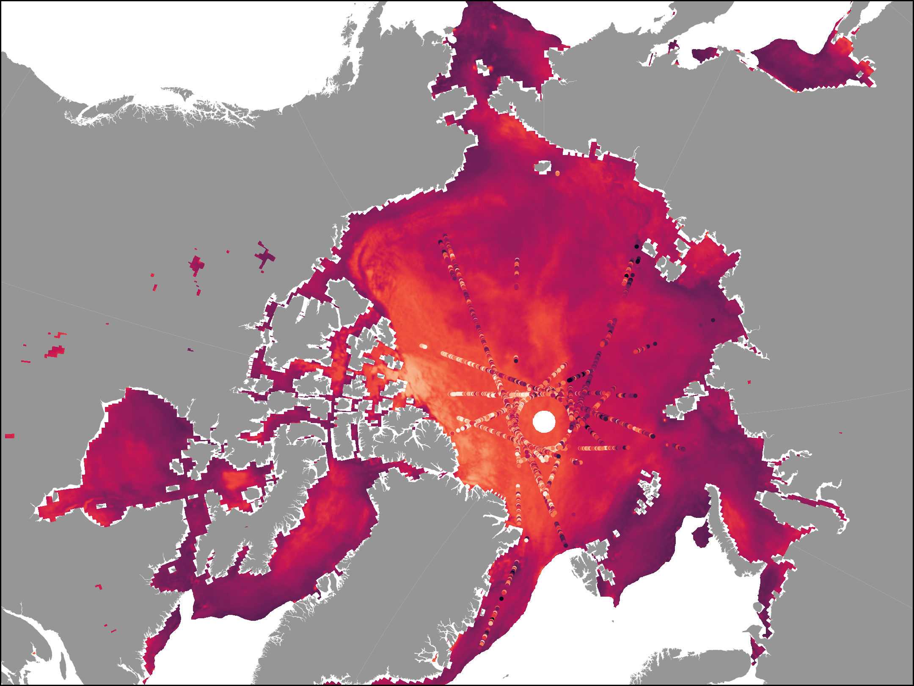

# Arctic Snow product: Daily pan Arctic snow product from passive microwave observations and CRYO2ICE

## Motivation
Since their inception in the 1970’s, methods for mapping snow depth using passive microwave (PMW) radiometerdata have been desired and developed, since PMW data have a large spatiotemporal extent. With a proper snow depth training set, one might be able to fit a model that can identify the correct snow depth even given complicated local dynamics.

Fredensborg Hansen et al. (2024) [1] investigated the near-coincident radar and laser altimetry observations from the CryoSat-2 and ICESat-2 Resonance (CRYO2ICE) campaign, which was initiated in July 2020, for the winter seasons of 2020-2022. A dataset where created from this, consisting of snow depth observations for November-April for both 2020-2021 and 2021-2022. The datasets vast spatio-temporal expanse means it has the potential of being more generalizable than other available snow products for training PMW based snow depth models. With this project, we have tried to create such a model. We have for this utilized Random Forest Regression (RFR). For input data, we have used AMSR2 data from the Calibrated Enhanced-Resolution Passive Microwave Daily EASE-Grid 2.0 Brightness Temperature ESDR, Version 2 (CETB) of NSIDC [2]. For target data, we used the CRYO2ICE (C2I) dataset by Fredensborg Hansen et al. (2024) [3].

## Data
The project utilizes AMSR2 CETB [2] channels as input, with CRYO2ICE data [3] as target variables, additionally, for experimentation, snow depth measures from Operation Ice Bridge [4,5] and AEM AWI [6,7] have been included and can be processed with the code presented here. Finally, ERA5 daily parameters are also collocated to the grid [8]. An overview of all datasouces and how one includes them in the repository is seen in ./data/readme.txt

## Methods
The repository here generally achieves 3 things:
1) to create a training dataset which regrids point-like snow depth observations using drop-in-bucket resampling, and collocates these observations with AMSR2 and ERA5 observations.
2) Tune and fit a Random Forest Regression model using cross validation, given training data and weights.
3) Predicts snow depths for the entire Arctic using AMSR2 channels as input and ERA5 siconc for masking.

## References
[1] Fredensborg Hansen et al. (2023): Arctic freeboard and snow depth from near-coincident CryoSat-2 and ICESat-2 (CRYO2ICE) observations: A first examination during winter 2020-2021. ESS Open Archive. https://doi.org/10.22541/essoar.168614619.96485405/v1

[2] Brodzik, M. J., Long, D. G. & Hardman, M. A. (2024). Calibrated Enhanced-Resolution Passive Microwave Daily EASE-Grid 2.0 Brightness Temperature ESDR. (NSIDC-0630, Version 2). [Data Set]. Boulder, Colorado USA. NASA National Snow and Ice Data Center Distributed Active Archive Center. https://doi.org/10.5067/19LHYLUXZ22M. [describe subset used if applicable]. Date Accessed 11-25-2025.

[3] Fredensborg Hansen, Renée Mie; Skourup, Henriette; Rinne, Eero; Høyland, Knut Vilhelm; Landy, Jack; Merkouriadi, Ioanna; et al. (2023). CRYO2ICE radar/laser freeboards, snow depth on sea ice and comparison against auxiliary data during winter seasos 2020-2022. Technical University of Denmark. Dataset. https://doi.org/10.11583/DTU.21369129.v2

[4] Kurtz, N., Studinger, M., Harbeck, J., Onana, V. & Yi, D. (2016). IceBridge Sea Ice Freeboard, Snow Depth, and Thickness Quick Look. (NSIDC-0708, Version 1). [Data Set]. Boulder, Colorado USA. NASA National Snow and Ice Data Center Distributed Active Archive Center. https://doi.org/10.5067/GRIXZ91DE0L9. [describe subset used if applicable]. Date Accessed 11-25-2025.

[5] Kurtz, N., Studinger, M., Harbeck, J., Onana, V. & Yi, D. (2015). IceBridge L4 Sea Ice Freeboard, Snow Depth, and Thickness. (IDCSI4, Version 1). [Data Set]. Boulder, Colorado USA. NASA National Snow and Ice Data Center Distributed Active Archive Center. https://doi.org/10.5067/G519SHCKWQV6. [describe subset used if applicable]. Date Accessed 11-25-2025.

[6] A. Jutila et al., Airborne snow depth on sea ice during the IceBird Winter 2019 campaign in the Arctic Ocean, Version 1, dataset publication series, 2021. DOI: 10.1594/PANGAEA.932790. [Online]. Available: https://doi.org/10.1594/PANGAEA.932790.

[7] A. Jutila, S. Hendricks, R. Ricker, L. von Albedyll and C. Haas, Airborne sea ice parameters during the PAMARCMIP2017 campaign in the Arctic Ocean, version 1, dataset publication series, 2021. DOI: 10.1594/PANGAEA.933883. [Online]. Available: https://doi.org/10.1594/PANGAEA.933883.

[8] Copernicus Climate Change Service, Climate Data Store, (2024): ERA5 post-processed daily-statistics on single levels from 1940 to present. Copernicus Climate Change Service (C3S) Climate Data Store (CDS), DOI: 10.24381/cds.4991cf48 (Accessed on 25-11-2025)

# Usage
The repository is generally structured around the scripts of src.pipeline. Each script has its own .yaml file in ./configs/pipeline_configs, where relevant settings can be ajusted accordingly.
The script "setup.py" will initialize relevant subfolders in "./data" for intermediate and processed output. The folders are unnecessary if load and save paths are altered in pipeline_configs, but matches the current configurations.

The pipeline scripts can be excecuted using:
>python -m src.pipeline.{scriptname}

The scripts are described below and can generally be run in the desribed order:
* create_dataset:
Creates a training dataset in .parquet format. The set uses all given snow depth measures, which are drop-in-bucket resampled to the desired grid, before being collocated with desired AMSR2 channels and ERA5 attributes.

* split_dataset:
Separates created dataset into training and test subsets that are temporally disassociated with one another.

* perform_RFR_cross_validation:
Performs cross validation using random forest regression, and folds split in time. Returns parametergrid containing all results along with yaml describing best parameters.

* create_RFR_model:
Creates a random forest regression model from a training set and given best parameters (either hardcoded or from yaml).

* predict_data:
Makes mapped snow depth predictions using full AMSR2 scenes.

* aggregate_predictions:
Makes monthly predictions from the daily mappings of the previous script.

Beyond the pipeline scripts various tools have been developed for handling point-like and gridded data in conjunction with one another. Finally, the "analysis" folder contains notebooks used for visualizing results. The code is included for completion and is not intended to be user friendly, and external data sources are needed to make it operative.
